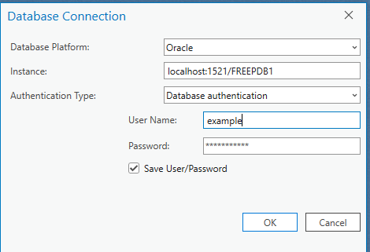

# INSTALL - UTC to Local Time Converter - Utility Package
## Requirements
- System Requirements
    - Oracle w/ oracle spatial
## Download Files
View latest release: https://github.com/MichaelAkridge-NOAA/UTC-to-Local-Time-Utility/releases/
## Setup
1. Import timezone tables into schema
2. Import utc to local timezone function(s)


## Example Installs
### Example | Install Timezone Data Table(s) via Data pump util: 
- can be used via sql dev wizard or via command line
- file "./EXPDAT01-18_54_12.DMP"

```
impdp username/password DIRECTORY=directory DUMPFILE=EXPDAT01-00_51_06.DMP TABLE_EXISTS_ACTION=REPLACE
```
### Example | Install Timezone Data Table(s) via shapefile & ArcGIS Pro
- Importing a Shapefile into ArcGIS Pro (drag and drop or see below)
    - unzip shape file found in ("./UTL_TIMEZONE_LOCATIONS_GLOBAL_SHP.zip")
    - Start ArcGIS Pro and open your project.
    - Add Data to Your Project:
    - Navigate to the “Map” tab on the top menu.
    - Click on the “Add Data” dropdown.
    - Choose “Data” from the dropdown options.
    - Browse to the location of your shapefile (.shp) on your computer or network.
    - Select the shapefile you want to import and click “OK.”
    - The shapefile will now appear in your project’s Contents pane and on the map.
            
- Setup Database Connection
    - Go to the Catalog Pane:
    - Right-click on the “Databases” item and select “New Database Connection” from the context menu.
    -  Enter Connection Details like so
- Exporting Features to a Database
    - After you’ve imported your shapefile into ArcGIS Pro, you can export its features to a geodatabase by following these steps:
    - Right-click the layer (the imported shapefile) in the Contents pane that you want to export to a database.
    - Choose “Data” and then “Export Features.”
    - In the Export Features pane:
    - For “Output Feature Class,” click the folder icon to specify the output location. Here, you will choose your database. If you're exporting to an enterprise geodatabase, make sure you have the appropriate connection set up.
    - You may give a new name to the output feature class or use the default one provided.
    - Adjust any other export options as needed.
    - Click “Run” to execute the export. The features from your shapefile will now be exported to the specified location in your database.

### Example | Import utc to local timezone function -  Just Run the Sql file via sql dev or cmd
### UTC to Local w/ Offset
```
CREATE OR REPLACE FUNCTION f_convert_utc_to_local_offset(
    p_utc_timestamp IN TIMESTAMP,
    p_utc_offset_str IN VARCHAR2 -- The offset in the format 'UTC+HH:MI' or 'UTC-HH:MI'
) RETURN TIMESTAMP DETERMINISTIC IS
    v_local_timestamp TIMESTAMP;
    v_utc_offset VARCHAR2(6); -- To store '+HH:MI' or '-HH:MI' format
BEGIN
    -- Extract the offset part from the input string, the format 'UTC+HH:MI' or 'UTC-HH:MI'
    -- The extraction skips the first 3 characters ('UTC') and captures the rest
    v_utc_offset := SUBSTR(p_utc_offset_str, 4);
    -- Convert the UTC timestamp to a TIMESTAMP WITH TIME ZONE using the extracted offset
    v_local_timestamp := FROM_TZ(p_utc_timestamp, 'UTC') AT TIME ZONE v_utc_offset;

    RETURN v_local_timestamp;
EXCEPTION
    WHEN OTHERS THEN
        RETURN NULL;
END f_convert_utc_to_local_offset;
/

```
### UTC to Local w/ Timezone Global Dataset
```
CREATE OR REPLACE FUNCTION f_convert_utc_to_local_global(
    p_utc_timestamp IN TIMESTAMP,
    p_tz_id IN VARCHAR2
) RETURN TIMESTAMP DETERMINISTIC IS
    v_local_timestamp TIMESTAMP;
BEGIN
    EXECUTE IMMEDIATE 
        'SELECT FROM_TZ(CAST(:1 AS TIMESTAMP), ''UTC'') AT TIME ZONE ''' || 
        REPLACE(p_tz_id, '''', '''''') || ''' FROM dual'
    INTO v_local_timestamp
    USING p_utc_timestamp;

    RETURN v_local_timestamp;
EXCEPTION
    WHEN OTHERS THEN
        RETURN NULL;
END f_convert_utc_to_local_global;
/    
```


### View/Export as GEOJSON
```
SELECT
    DBMS_LOB.SUBSTR(SDO_UTIL.TO_GEOJSON(a.SHAPE), 4000, 1) AS GEOJSON_TEXT
FROM
    UTL_TZ_LOC_GLOBAL a;
```
Output Example:
```
{ "type": "MultiPolygon", "coordinates": [ [ [ [-157.436106999638, 21.333860000039], [-157.43658700019, 21.337334000164], [-157.437131000096, 21.3407999999201], [-157.437276999634, 21.341660000009], [-157.437878000369, 21.3451180002955], [-157.438543999606, 21.3485650000748], [-157.439273999995, 21.352001000246], [-157.440067999738, 21.3554239998178], [-157.440925999735, 21.3588339996894], [-157.441846999939, 21.3622289997685], [-157.442832000396, 21.3656080000092], [-157.443879000116, 21.3689719995582], [-157.444989000042, 21.3723170000296], [-157.445151000318, 21.3727910003045], [-157.445989000292, 21.3762050003605], [-157.44689099962, 21.3796049997709], [-157.447856000054, 21.3829890002422], [-157.448882999751, 21.3863580000217], [-157.449972999654, 21.3897089998705], [-157.451125999765, 21.3930419997885], [-157.452341000037, 21.3963549996835], [-157.453617000424, 21.3996479995556], [-157.454954000027, 21.4029190002117], [-157.456351999745, 21.4061689998995], [-157.457810999578, 21.409394000233], [-157.458484000037, 21.4108319999968], [-157.460018999777, 21.4140259998001], [-157.46161300044, 21.4171950002491], [-157.463267000272, 21.4203380003984], [-157.464978000035, 21.4234530001559], [-157.46674799982, 21.4265400004207], [-157.46857400039, 21.4295970002015], [-157.470458000037, 21.4326240003974], [-157.472397999568, 21.4356190000169], [-157.473932000162, 21.4379070003079], [-157.475960000154, 21.4408520003196], [-157.478041999938, 21.4437619996166], [-157.480178000414, 21.4466380000437], [-157.482367999783, 21.4494789997561], [-157.484609999752, 21.4522829995609], [-157.486904000319, 21.4550510004034], [-157.487164999765, 21.4553590002178], [-157.489500000425, 21.4580959996308], [-157.491885999839, 21.4607949999893], [-157.49432199976, 21.4634540003019], [-157.496807000143, 21.4660729996692], [-157.499088000111, 21.4683979998679], [-157.500030000384, 21.4705039998598], [-157.500533000198, 21.4716289995787], [-157.502038000353, 21.4748370000276], [-157.503096999727, 21.4770050001807], [-157.503263000187, 21.480504999706], [-157.503494000048, 21.4840009999463], [-157.503790000208, 21.487493000002], [-157.504151999815, 21.4909799998272], [-157.504577999675, 21.4944600002289], [-157.505068999834, 21.4979330003078], [-157.505625000294, 21.5013969999716], [-157.506246000153, 21.5048520001197], [-157.506931000265, 21.5082959997606], [-157.507679999732, 21.5117279997474], [-157.508493000352, 21.5151480000802], [-157.509370000325, 21.5185529997212], [-157.510309999607, 21.5219439996159], [-157.511312999995, 21.5253189996722], [-157.512378999691, 21.5286769998437], [-157.513507999594, 21.5320170000845], [-157.514698999659, 21.5353380003485], [-157.515950999839, 21.5386399997362], [-157.51726500018, 21.5419199999081], [-157.518640999782, 21.5451779999648], [-157.520076000307, 21.5484139999062], [-157.521572000048, 21.5516249995941], [-157.523127999857, 21.5548109999278], [-157.52474299969, 21.5579720000079], [-157.526417000444, 21.5611059997422], [-157.526753999797, 21.5617200001779], [-157.528443000344, 21.5648460004426], [-157.530189999968, 21.5679450003615], [-157.53199499957, 21.5710139997963], [-157.533857000001, 21.5740529996463], [-157.535776000362, 21.5770619999114], [-157.537750999709, 21.5800379995541], [-157.539779999747, 21.582982000419], [-157.54186499967, 21.5858929997622], [-157.544004000284, 21.5887690001892], [-157.544514000421, 21.5894389996102], [-157.546717000389, 21.592271999853], [-157.54897400015, 21.5950680001881], [-157.551281999565, 21.5978269997163], [-157.553641000432, 21.6005480001901], [-157.556051000054, 21.6032299997647], [-157.558510000136, 21.6058730002388], [-157.561018999827, 21.6084739996754], [-157.563574999886, 21.6110339999192], [-157.566180000407, 21.6135520000248], [-157.56883100035, 21.6160279999922], [-157.571527999717, 21.6184589996831], [-157.574269000214, 21.6208460000429], [-157.577056000134, 21.6231880001262], [-157.579885000193, 21.6254839998867], [-157.582757000435, 21.627734000224 ...............................................................
```

