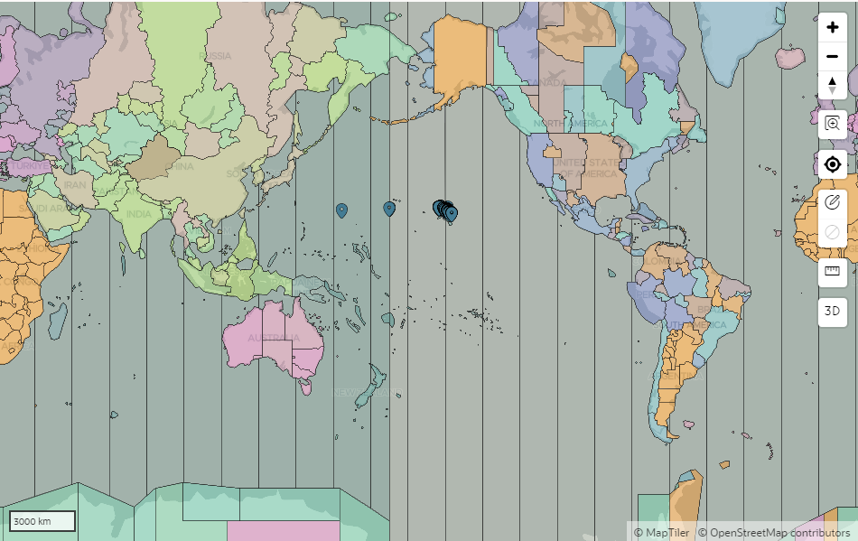
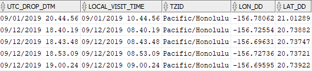
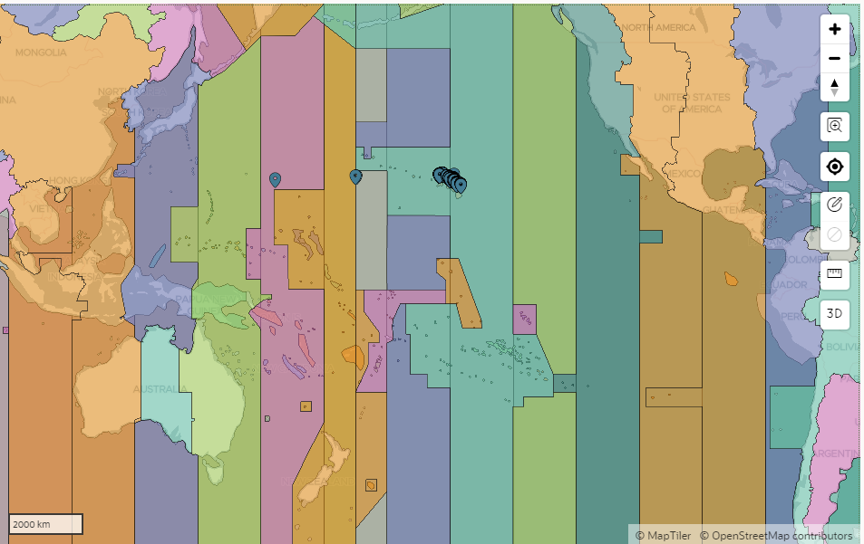
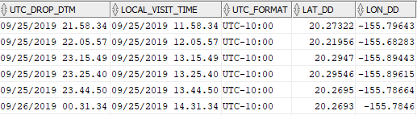

# UTC to Local Time Converter - Utility Package


#### Version: v1.0 | 20240404
#### Contact: michael.akridge@noaa.gov

## Purpose:
- To automatically convert a given database UTC time record to local time based on a datasets location

## Overview
- Uses a query to find records that spatially correspond to areas defined in timezone spatial table, essentially determining the time zone (tzid) for each record based on its geographic location. 
- This allows for converting UTC time to the local time using a custom function (convert_utc_to_local), which takes the UTC time and the time zone ID or offset to perform the conversion.
## Setup
#### Requirements
- System: Oracle w/ [oracle spatial ](https://blogs.oracle.com/oraclespatial/post/spatial-now-included-with-all-editions-of-oracle-database)
- Dataset: UTC data column & Location data columns (lat,long)
#### Install (See the [INSTALL.md](./INSTALL.md) for more details)
1. Import timezone tables into schema
2. Import utc to local timezone function(s)

## Global Timezone Boundaries Dataset


### Timezones Dataset Details: 
- This dataset has over 400 time zone boundaries and IDs for the world
- Ocean time zones from Etc/GMT+12 to Etc/GMT-12 are available where there is no specific timezone boundary

## Spatial query example | Global Timezone Boundaries Dataset
- Table: UTL_TIMEZONE_LOCATIONS_GLOBAL
- Function: f_convert_utc_to_local_global
#### Local Time & Daylight Savings Time(DST) is Auto Calculated
- Time zone offset is Auto Calculated based on
    - a supplied UTC(date/time) data column
    - location(lat/long) data columns that are mapped via oracle spatial function to a reference table with timezone ids & boundaries, 
    - and then oracle time function(AT TIME ZONE) for conversion
- For daylight savings time (DST), it is also auto calculated if location falls within a location polygon that observes DST
```
SELECT 
    a.OBJECTID, 
    a.UTC_DTM,
    a.LON_DD,
    convert_utc_to_local(a.UTC_DROP_DTM,  b.tzid ) AS local_visit_time,
    a.LAT_DD, 
    b.tzid 
FROM 
    EXAMPLE_DATA_TABLE a, UTL_TIMEZONE_LOCATIONS_NAME b
WHERE 
    SDO_RELATE(b.SHAPE, SDO_GEOMETRY(2001, 8307, SDO_POINT_TYPE(a.LON_DD, a.LAT_DD, NULL), NULL, NULL), 'mask=ANYINTERACT') = 'TRUE';
```


### See the [NOTES.md](./NOTES.md) for more details on SDO (Spatial Data Option) functions

## UTC Offset Boundaries Dataset


### Timezones Dataset Details: 
- This dataset has ~120 time zone boundaries
- Focus on UTC time zones UTC+12 to UTC-12
- Includes:
    - UTC_FORMAT(offset)
    - TIME_ZONE
    - ISO_8601
    - TZ_NAME
    - PLACES
    - DST_PLACES

#### Timezone Calculation
- Uses UTC offset to create local time

## Spatial query example | UTC Offset Boundaries Dataset
- Table: UTL_TIMEZONE_LOCATIONS_UTC
- Function: f_convert_utc_to_local_offset

```
SELECT 
    a.OBJECTID, 
    a.UTC_DTM,
    a.LON_DD,
    f_convert_utc_to_local_offset(a.UTC_DROP_DTM,  b.UTC_FORMAT ) AS local_visit_time,
    a.LAT_DD, 
    b.UTC_FORMAT 
FROM 
    EXAMPLE_DATA_TABLE a, UTL_TIMEZONE_LOCATIONS_UTC b
WHERE 
    SDO_RELATE(b.SHAPE, SDO_GEOMETRY(2001, 8307, SDO_POINT_TYPE(a.LON_DD, a.LAT_DD, NULL), NULL, NULL), 'mask=ANYINTERACT') = 'TRUE';
```



## Notes
### See the [NOTES.md](./NOTES.md) for more details on dataset

## Sources
- Public Timezones & location data: 
    - OpenStreetMap database 
    - Timezone Database (https://www.iana.org/time-zones)
    - CIA World Factbook for global timezones
#### See the [NOTES.md](./NOTES.md) for more details
----------
#### Disclaimer
This repository is a scientific product and is not official communication of the National Oceanic and Atmospheric Administration, or the United States Department of Commerce. All NOAA GitHub project content is provided on an ‘as is’ basis and the user assumes responsibility for its use. Any claims against the Department of Commerce or Department of Commerce bureaus stemming from the use of this GitHub project will be governed by all applicable Federal law. Any reference to specific commercial products, processes, or services by service mark, trademark, manufacturer, or otherwise, does not constitute or imply their endorsement, recommendation or favoring by the Department of Commerce. The Department of Commerce seal and logo, or the seal and logo of a DOC bureau, shall not be used in any manner to imply endorsement of any commercial product or activity by DOC or the United States Government.

#### License
See the [LICENSE.md](./LICENSE.md) for details
